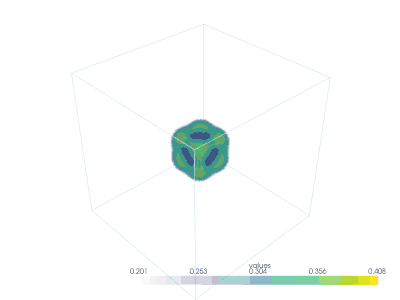

# Introduction
 Here is a simple 3D Gray-Scott simulator. 
 The aim of this project is to have a first look at the Kokkos library.

 From the [Kokkos](https://github.com/kokkos) github repo : 
> The Kokkos C++ Performance Portability Ecosystem is a production level solution for writing modern C++ applications in a hardware agnostic way.
Thanks to Kokkos, you can compile this code for multiple backends like OpenMP, CUDA, HIP.


**Disclaimer:** Please note that this project is a work in progress and may contain errors or programming oversights due to its experimental nature. Your understanding and feedback are appreciated as we continue to develop and refine this code.

# Compilation
Compile the code with the following commands : 
```
git submodule update --init --recursive
mkdir build && cd build && cmake ..
make -j 
```

# Usage
You can currently launch the executable named `GS` with the following command :
```
./GS
```
This will run the executable with the default parameters.
## Future customization options

In a future release, you will be able to customize the parameters via the CLI. The following example demonstrates how to launch the program with specific parameters:
```
./GS --dim 3D --stencil 7 --Du 0.05 --Dv 0.04 ...
```
All the available parameters are given by : 
```
./GS --help
```

# Prerequisites
The code use Kokkos as a performance portability library. Then, you must have it to compile the project.
I suggest you to install it and read the documentation for further understanding. 

It is possible to easily install `Kokkos` through the HPC [`spack`](https://github.com/spack) package manager. I suggest you to create a new environment : 
```
spack env create kokkos
spack env activate kokkos
spack install kokkos // here you can specify your backend like OpenMP, pthread, CUDA, HIP, ... please read the doc
spack load kokkos
```

The python visualizer works withthe packages `h5py`, `numpy`, `pyvista` and `imageio`. You can install them with your favorite python installation : 
```
pip3 install h5py pyvista numpy imageio
```
These packages enable reading HDF5 files and generating scientific visualizations using VTK through `PyVista`.

# ShowCase
The animation above illustrates the complex evolving patterns generated by the Gray-Scott model in 3D. 


We generate the animation with the python library `pyvista` throught the python script `clip.py`. 
**Disclaimer** : Please note that the generator can be very slow even with a powerful computer. 

# Todo 
### To-Do List

- [x] Refactoring
- [ ] Hierarchical parallelism with Kokkos
- [ ] Shared memory kernels with scratch pads
- [ ] Kokkos::SIMD usage
- [x] Add periodic boundary conditions
- [x] Python animation generator
- [x] Set up the CMake build system
- [x] Test the code on different backends (CUDA, OpenMP, Serial)
- [x] Provide MVP (Minimum Viable Product)
