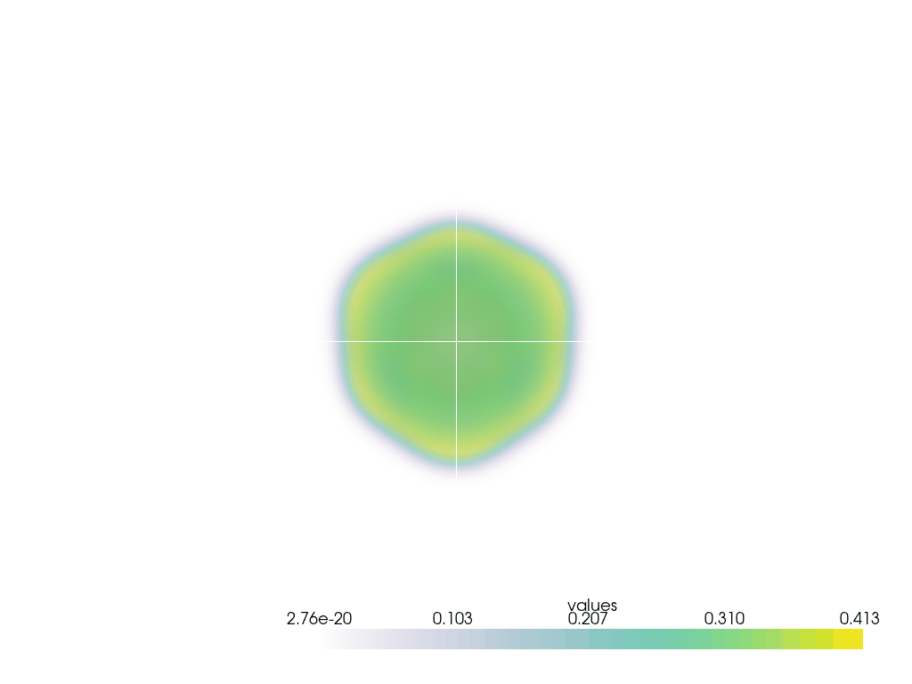

# Introduction
 Here is a simple 3D Gray-Scott simulator. 
 The aim of this project is to have a forst look at the Kokkos library.

 From the [Kokkos](https://github.com/kokkos) github repo : 
> The Kokkos C++ Performance Portability Ecosystem is a production level solution for writing modern C++ applications in a hardware agnostic way.
Thanks to Kokkos, you can compile this code for multiple backends like OpenMP, CUDA, HIP.

**Disclaimer:** Please note that this project is a work in progress and may contain errors or programming oversights due to its experimental nature. Your understanding and feedback are appreciated as we continue to develop and refine this code.

# ShowCase

# Prerequisites
The code use Kokkos as a performance portability library. Then, you must have it to compile the project.
I suggest you to install it and read the documentation for further understanding. 

# Todo 
### To-Do List

- [ ] Refactoring
- [ ] Hierarchical parallelism with Kokkos
- [ ] Shared memory kernels with scratch pads
- [ ] Kokkos::SIMD usage
- [ ] Fast Multipole Method (FMM) implementation
- [ ] Add periodic boundary conditions
- [ ] Python animation generator
- [ ] Set up the CMake build system
- [ ] Test the code on different backends (CUDA, OpenMP, Serial)
- [ ] Provide MVP (Minimum Viable Product)
